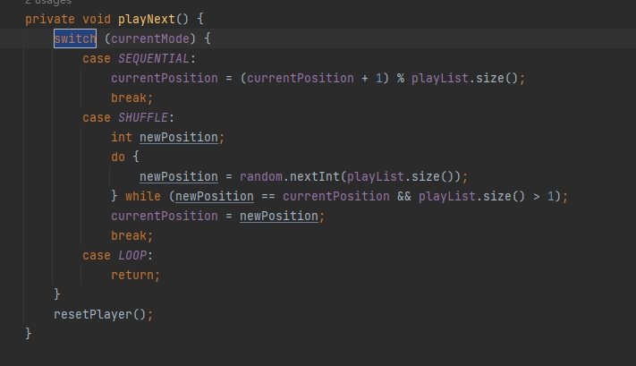

# Day3

**文件目录结构**

**1、MiniPlayerView**

主要实现的是首页悬浮View.继承自LinearLayout是一个自定义视图组件。然后在HomeActivity中使用悬浮View，并且在首页布局中将MiniPlayerView放在底部。通过MusicService控制播放。

**2、PlaylistAdapter**

PlaylistAdapter是一个自定义音乐列表的适配器。PlayerActivity中使用对话框Dialog来显示音乐列表，通过Intent传入多个音乐项，在PlayerActivity（音乐播放页面）定义List<MusicInfo>代表音乐列表。音乐列表设置了删除按钮，调用onDeleteClick方法，从播放列表移除音乐项，更新适配器。

在HomeActivity中添加public方法：将某个音乐项item添加到音乐列表中。在banner等各个adapter中调用这个方法。

首次加载（page==1）时调用randomPlayModuleMusic随机选择一个模块播放音乐。

录屏如下：

# **DAY2**

老师抱歉，电脑出了点问题，打开文件资源管理器电脑就会卡顿或者死机，因为今天图标较多，所以今天内容中的图标都是直接使用代码生成的，就没有在Figma上面导出。

更新：将图标替换为figma上的图标

**文件目录结构**

**1、MusicService类**

音乐播放的核心功能、后台播放和通知控制。通过MusicBinder提供与Activity的绑定接口

1）基础的音乐播放功能，通过MediaPlayer实现底层音频播放

2）后台播放，startForeground设置为前台服务

**2、PlayerActivity**

这是音乐播放器的主界面，负责用户交互和页面展示

1）设置Activity为单例模式，避免重复创建多个播放页

2）通过ServiceConnection绑定到MusicService实现播放/暂停/上一首/下一首按钮控制以及播放模式切换，通过Service实现后台长期运行

3）使用Glide加载网络或本地封面图片，使用Palette库分析图片的颜色并设置背景色

4）使用OkHttp异步加载网络歌词，成功加载后使用parseLyrics解析原始歌词

5）切换播放模式，再根据SHUFFLE,SEQUENTIAL,LOOP处理不同的播放逻辑。

录屏：

# **DAY1**

**闪屏页面的弹窗：**

1、使用SharedPreferences存储用户是否同意协议的状态

2、使用Handler延迟1秒显示协议对话框

3、使用SpannableString实现协议文本中的可点击链接

**首页：**

**1、文件目录结构：**

1）HomeActivity是首页。

2）MainActivity是闪屏页面。

3）adapter：每个模块有一个适配器BannerAdapter、HorizontalCardAdapter（横划大卡）、DailyRecommendAdapter（一行一列）、TwoColumnAdapter（一行两列）。

4）HomeResponse（表明API完整响应结构：**code，msg，data**（实际数据内容--HomeData对象））

5）HomeData（包含实际的数据记录的列表：**records**，在HomeActivity中遍历records来初始化每个模块）

6）ModuleConfig（描述首页的展示模块和配置：**moduleConfigId**模块唯一标识，**moduleName**模块名称，**style**模块样式，**musicInfoList**该模块包含的音乐列表）

7）MusicInfo（音乐信息）

**2、功能简介**

RecyclerView和动态添加View

网络请求 → JSON解析 → 按模块分类 → 各Adapter更新

1）、okHttp请求数据后根据module name分类。Glide加载图片。

2）、轮播图（Banner）

ViewPager2 + BannerAdapter

3）、横划大卡

RecyclerView（水平布局）+ HorizontalCardAdapter

4）、一行一列

简单列表项展示

5）、一行两列

两列网格数据，标准网格项实现

6）、下拉刷新

重置数据，重新加载第一页

录屏如下：

